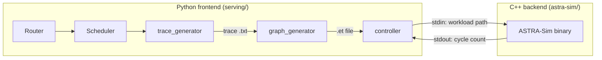
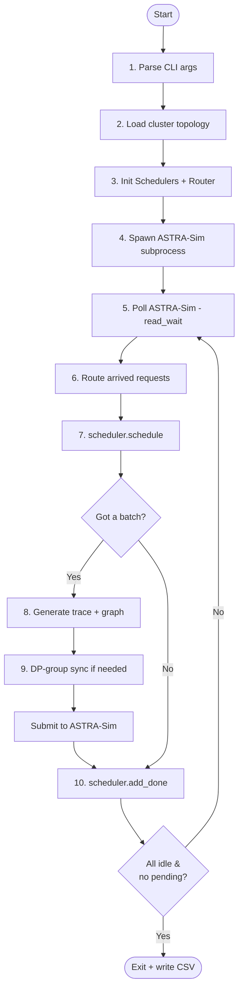
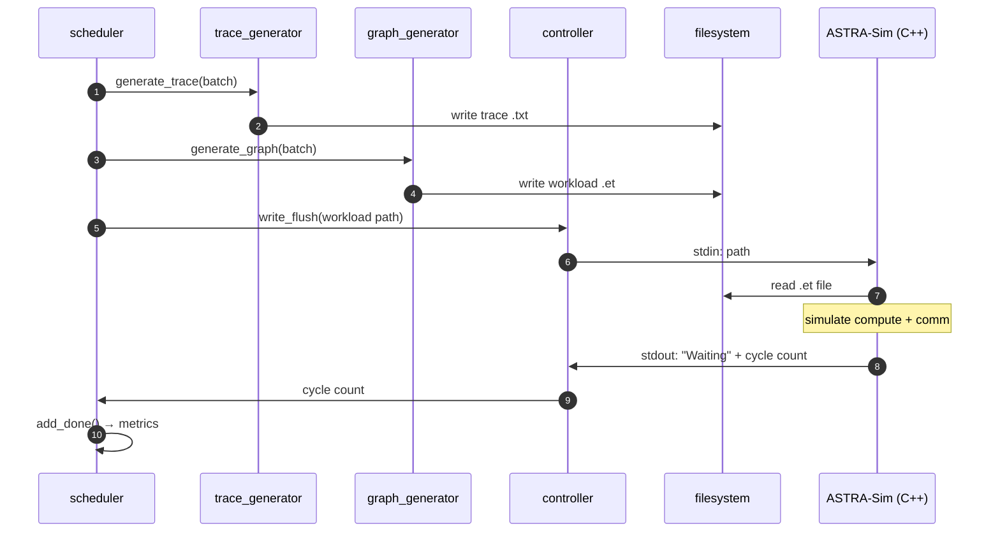

# Architecture overview

LLMServingSim is two pieces glued together: a **Python serving
frontend** (`serving/`) that does request scheduling, batching, and
trace generation, and a **C++ analytical backend**
([ASTRA-Sim](https://github.com/astra-sim/astra-sim)) that simulates
compute and collective communication on a configurable network.

The Python side is the orchestrator. The C++ side is the
cycle-counting engine that returns elapsed time for each batch.

> This page is the "how it works" overview. If you're looking for
> "how to configure it," see **[Examples](/docs/examples)** instead.

## The two halves

| Layer | Lives in | Talks in | Owns |
| --- | --- | --- | --- |
| **Python frontend** | `serving/` | Requests, Batches, Traces | Scheduling, prefix caching, memory accounting, trace generation |
| **C++ backend** | `astra-sim/` | Chakra `.et` graphs, cycle counts | Compute kernel timing, collective comm modeling, network topology |

They communicate through a single subprocess pipe with a tiny string
protocol, see [Python ↔ C++ boundary](#python--c-boundary) below.

## The 10-step main loop

`serving/__main__.py` drives the simulation. Every iteration of the
loop ticks the simulated clock forward by however many nanoseconds
the next batch takes:

1. **Parse CLI args**: cluster config path, batch parameters,
   routing/expert policies, feature flags
   (`--enable-prefix-caching`, `--enable-attn-offloading`, etc.).
2. **Load cluster topology** via `config_builder`: extracts
   `num_nodes`, instance layout, NPU↔instance mappings, generates
   ASTRA-Sim input files (`network.yml`, `system.json`,
   `memory_expansion.json`).
3. **Initialize per-instance Schedulers and the global Router.**
   Optionally load requests from the dataset.
4. **Spawn the ASTRA-Sim subprocess** (analytical or ns3 backend).
5. **Poll ASTRA-Sim**: `controller.read_wait()` blocks until the
   subprocess says `Waiting`, signaling a completed iteration on some
   NPU.
6. **Route any newly arrived requests** -
   `router.route_arrived_requests(current)` moves requests whose
   `arrival_time_ns <= current` into the appropriate scheduler queue.
7. **Schedule the next batch** -
   `scheduler.schedule(current, sys)` returns a `Batch` (or `None`
   if there's nothing to run).
8. **If we got a batch**: generate the per-layer compute trace
   (`trace_generator.generate_trace`), convert it to a Chakra graph
   (`graph_generator.generate_graph`), and push the graph path to
   ASTRA-Sim (`controller.write_flush`).
9. **DP-group sync** *(optional)*: instances in the same `dp_group`
   defer trace generation until **all** group members have scheduled
   for this iteration, then submit together with a synchronized
   ALLTOALL `comm_size`.
10. **Mark requests done** when ASTRA-Sim reports completion via
    `scheduler.add_done(...)`. The loop exits when every instance is
    idle and there are no pending or deferred requests.

The clock variable is `current` (in **nanoseconds**); converted to
seconds only at output time. Cycle counts come from ASTRA-Sim and add
to `current` on each iteration.

## Module map

The Python frontend is split into focused modules under
`serving/core/`. Each is the subject of a dedicated page in this
section:

| Module | Role | Read more |
| --- | --- | --- |
| `request.py` | `Request` and `Batch` data classes | [Request lifecycle](./request-lifecycle) |
| `router.py` | Cross-instance routing, agentic dependency chains | [Request lifecycle](./request-lifecycle) |
| `scheduler.py` | Per-instance vLLM-style continuous batching | [Continuous batching](./scheduling/continuous-batching) |
| `radix_tree.py` | RadixCache for prefix caching | [Prefix caching](./scheduling/prefix-caching) |
| `memory_model.py` | KV cache and weight memory accounting | [KV cache & memory](./scheduling/kv-cache-and-memory) |
| `trace_generator.py` | Per-layer trace from profile CSVs | [Trace generation](./trace-generation) |
| `graph_generator.py` | Chakra `.et` emitter | [Trace generation](./trace-generation) |
| `gate_function.py` | MoE expert routing | [MoE expert routing](./moe-expert-routing) |
| `pim_model.py` | PIM device latency model | [PIM offload](./specialized/pim-offload) |
| `power_model.py` | Power and energy accounting | [Power model](./specialized/power-model) |
| `controller.py` | ASTRA-Sim subprocess IPC | [Below](#python--c-boundary) |
| `config_builder.py` | Cluster config → ASTRA-Sim input files | [Examples → Cluster config explained](/docs/examples/cluster-config-explained) |

## Python ↔ C++ boundary

There's exactly **one** cross-language boundary: the subprocess pipe
between `controller.py` and the ASTRA-Sim binary.

Concretely:

1. The Python scheduler decides which requests run this iteration and
   produces a `Batch`.
2. `trace_generator` writes a per-layer text trace to
   `astra-sim/inputs/runs/<run_id>/trace/<hw>/<model>/instance_{i}_batch_{b}.txt`.
3. `graph_generator` shells out to the Chakra converter, producing a
   protobuf graph at
   `astra-sim/inputs/runs/<run_id>/workload/<hw>/<model>/instance_{i}_batch_{b}/llm.et`.
4. `controller.write_flush(process, "<workload-path>")` sends that
   path over stdin.
5. ASTRA-Sim reads the `.et` file, executes the compute + comm graph,
   prints `Waiting <sys=<npu>> id=<batch> cycle=<ns>` on stdout.
6. `controller.read_wait` parses that line; the main loop hands the
   cycle count to `scheduler.add_done` to update request metrics.

The protocol is just three commands on the Python → C++ direction:

- A workload path, start running this batch.
- `pass`: re-poll without computing (used during DP-group sync waits).
- `done`: this instance is idle.
- `exit`: shut down.

There is no shared memory, no callback API, no FFI, only files and a
text protocol. Adding a new feature on the Python side rarely
requires touching C++ as long as the trace fields the converter knows
about are sufficient (see
[Reference → Trace file format](/docs/reference/trace-format)).

## What state is shared, and where it lives

A few cross-module pieces of state are worth knowing about because
they show up in multiple pages:

- **`Router._pending_requests`**: requests loaded from the dataset
  but whose `arrival_time_ns` is in the future. Sorted by arrival.
- **`Router._deferred_sessions`**: agentic sessions waiting on a
  tool call to elapse before releasing the next sub-request.
- **`Scheduler.memory: MemoryModel`**: per-instance NPU + CPU
  memory tracker, including the per-instance NPU prefix cache.
- **Shared CPU/CXL `RadixCache`**: second-tier prefix pool. Optional
  (`--enable-prefix-sharing`); when enabled, all instances on a node
  share one tree.
- **`dp_pending` (in `__main__.py`)**: per-DP-group barrier dict
  used to coordinate wave-synchronized trace submission.

Each of these is explained in the page that owns it; this list is
just so you have a map when something cross-references.

## Where to go next

If you want to follow a single request from JSONL all the way to
the output CSV, read
**[Request lifecycle](./request-lifecycle)**. It walks the same loop
above but from the request's point of view, with concrete code paths.

If you want to understand the scheduler's job specifically, chunked
prefill, the difference between "schedule with prefix" and "schedule
base", PP pipeline depth, go to
**[Continuous batching](./scheduling/continuous-batching)**.
