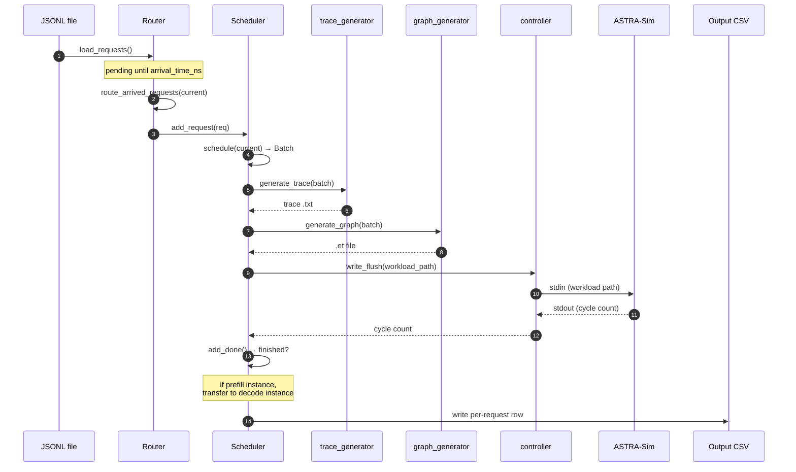

# Request lifecycle

This page follows a single request from the JSONL file all the way to
its row in the output CSV. Same main loop as
[Architecture overview](./architecture), but from the request's
perspective.

> Need the *configuration* angle (how to enable each feature)?
> See **[Examples](/docs/examples)**.



## Stage 1, Loaded into the Router

When `python -m serving --dataset workloads/foo.jsonl` starts up,
`router.load_requests()` parses the JSONL line by line and builds
`Request` objects:

```python
class Request:
    id: int
    model: str
    arrival_time_ns: int
    input_tokens: int        # prompt length
    output_tokens: int       # max decode length
    instance_id: int | None  # set on routing
    pd_type: str | None      # "prefill" or "decode" once routed
    session_id: str | None   # for agentic sessions
    sub_request_index: int   # 0 for flat, increments for sub-requests
    input_tok_ids: list[int] | None   # for prefix caching
    # ...metrics filled in later: ttft_ns, first_token_time_ns, etc.
```

Two formats supported in the same file:

- **Flat:** one JSONL entry = one independent request.
- **Agentic sessions:** one JSONL entry = one session with multiple
  chained sub-requests. Only the first sub-request is enqueued; the
  rest live in `Router._deferred_sessions` until released.

Requests with `arrival_time_ns > 0` are **not** routed yet, they
land in `Router._pending_requests`, sorted by arrival time.

## Stage 2, Waiting for arrival time

The simulator clock (`current` in `__main__.py`, in ns) marches
forward as ASTRA-Sim returns cycle counts. Once `current >=
request.arrival_time_ns`, `router.route_arrived_requests(current)`
pulls the request out of `_pending_requests`.

If all instances are idle but there are pending requests in the
future, `__main__.py` advances `current` directly to the next pending
arrival time to avoid busy-looping.

## Stage 3, Routed to an instance

The router applies its policy (`--request-routing-policy`):

| Policy | Behavior |
| --- | --- |
| `LOAD` (default) | vLLM-style: pick instance with smallest `waiting * 4 + running` score |
| `RR` | Pure round-robin |
| `RAND` | Random uniform |
| `CUSTOM` | Pluggable in `serving/core/router.py` |

For **prefill/decode disaggregation**, the router only considers
prefill instances at this stage. Decode instances receive the
request later via `transfer_prefill_request`.

Once routed, the request goes into the chosen
`Scheduler`'s waiting queue (`scheduler.add_request(req)`).

## Stage 4, Picked up by the scheduler

Each iteration, `scheduler.schedule(current, sys)` decides which
requests to include in the next `Batch`. The constraints:

- `len(batch) <= --max-num-seqs` (sequence count cap)
- `sum(tokens_to_run) <= --max-num-batched-tokens` (token budget)
- per-request `tokens_this_step <= --long-prefill-token-threshold`
  *(if set, gates chunked prefill)*

There are two scheduling paths:

- **Without prefix caching** (`schedule_base`): pure FIFO + token
  budget.
- **With prefix caching** (`schedule_with_prefix`): same plus
  RadixCache lookup that returns `hit_len` for each request.

The full mechanics are on
**[Continuous batching](./scheduling/continuous-batching)**.

## Stage 5, Wrapped in a Batch

`Batch` aggregates the chosen requests:

```python
class Batch:
    batch_id: int
    instance_id: int
    fired: list[bool]    # one entry per NPU; only first NPU emits trace
    total_len: int       # sum of tokens this iteration
    kv_len: int          # sum of KV-cache tokens after this step
    hit_len: int         # sum of prefix-cache hits across requests
    num_prefill: int
    num_decode: int
    q_list: list[int]    # query lengths per request
    k_list: list[int]    # KV lengths per request
    # ...
```

The `fired` list ensures multi-NPU instances only generate the trace
once (on rank 0); other ranks just read back the cycle count.

## Stage 6, Trace generated

`trace_generator.generate_trace(batch, hardware, tp_size, ...)` walks
the model's architecture YAML and looks up per-layer latencies in the
profile DB:

- Dense layers (qkv, mlp, etc.) → 1D linear lookup over `total_len`.
- Per-sequence layers (`lm_head`, `sampler`) → 1D over
  `num_requests`.
- Attention → 4D nearest-neighbour + bilinear over
  `(prefill_chunk, kv_prefill, n_decode, kv_decode)`. Skew correction
  blends two lookups using a per-bucket `alpha`.
- MoE → 2D over `(local_tokens, activated_experts)`, profiled at
  TP=1.

The output is a tab-separated text trace at
`astra-sim/inputs/runs/<run_id>/trace/<hw>/<model>/instance_{i}_batch_{b}.txt`.
Full mechanics on **[Trace generation](./trace-generation)**.

## Stage 7, Converted to Chakra graph

`graph_generator.generate_graph` shells out to Chakra's text→protobuf
converter, producing
`astra-sim/inputs/runs/<run_id>/workload/<hw>/<model>/instance_{i}_batch_{b}/llm.et`.

The Chakra converter creates:

- `MEM_LOAD_NODE` for the first layer's input (CPU → NPU).
- `COMP_NODE` for each computation layer.
- `MEM_STORE_NODE` for the last layer's output (NPU → CPU).
- `COMM_COLL_NODE` for ALLREDUCE / ALLTOALL collectives, with
  optional `involved_dim` BoolList for multi-dimensional topologies.

## Stage 8, Submitted to ASTRA-Sim

`controller.write_flush(process, workload_path)` sends the path over
stdin. ASTRA-Sim reads the `.et` file, simulates compute + comm
according to the network topology, and emits:

```
Waiting <sys=0> id=42 cycle=178654321
```

`controller.read_wait` blocks until that line appears.

For **DP groups**, both instances' `.et` files share the same workload
folder and matching stream IDs on the ALLTOALL collectives. ASTRA-Sim
blocks until both NPUs reach the collective, naturally
wave-synchronizing them.

## Stage 9, Marked done

`scheduler.add_done(npu_id, sys, current)` consumes the cycle count:

- Updates per-request running totals (cycles spent in this iteration
  attributed to each request based on `q_list`).
- For requests that finished decoding this step
  (`request.num_computed_tokens >= request.input + request.output`):
  records `last_token_time_ns`, computes `latency_ns`, marks done.
- Returns `(prompt_throughput, decode_throughput, finished_requests)`
  to the main loop.

For prefill instances (`pd_type="prefill"`), finished requests are
**transferred** to a decode instance via
`router.transfer_prefill_request`. The KV cache transfer cost is
modeled as inter-link bandwidth based on KV size.

## Stage 10, Output

Once all requests finish (and no agentic sub-requests are deferred),
the simulator writes the per-request CSV at the path you passed via
`--output`. One row per request:

```
request_id, arrival_ns, first_token_ns, last_token_ns,
prompt_toks, decode_toks, ttft_ns, tpot_ns, latency_ns,
prefix_hit_len, npu_cache_hit, storage_cache_hit, instance_id,
session_id, sub_request_index
```

(Exact columns depend on the version. Validation methodology and
column-by-column interpretation live on
**[Reading the output](./reading-output)**.)

## Agentic sessions: when stage 10 is not the end

For agentic JSONL entries (sessions with `sub_requests`), finishing
sub-request *N* triggers `router.notify_request_completed`, which:

1. Schedules sub-request *N+1* with arrival time =
   `completion_time + tool_duration_ns`.
2. Inserts it into `_pending_requests` (sorted by arrival).
3. Goes back to **Stage 2** for that sub-request.

`Router.has_deferred_sessions()` keeps the main loop from exiting
early while sessions are still in flight.

## What's next

- **[Continuous batching](./scheduling/continuous-batching)** -
  Stage 4 in detail.
- **[Trace generation](./trace-generation)**: Stage 6 in detail.
- **[Parallelism mechanics](./parallelism-mechanics)**: what
  happens at Stages 7-8 for TP / EP / DP+EP setups.
