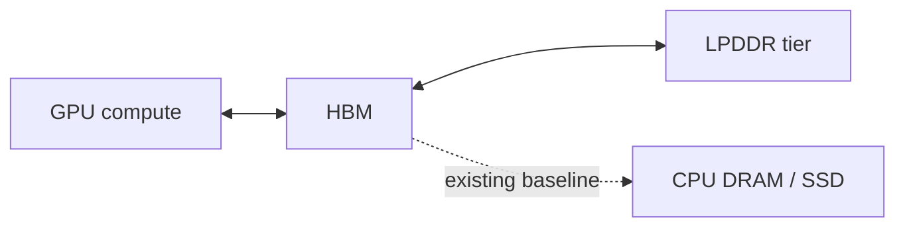

# LPDDR sparse KV tiering plan

이 문서는 LLMServingSim에 **GPU-HBM-LPDDR 계층형 KV cache**와
**DeepSeek-style sparse attention**을 추가하기 위한 구현 계획이다.

목표는 기존 CPU/SSD offload 대비, GPU 가까이에 붙은 LPDDR을 KV cache
second tier로 사용할 때 sparse attention workload의 성능 저하를 얼마나 줄일 수
있는지 시뮬레이션하는 것이다.

## 목표 환경

대상 메모리 구조는 다음과 같다.



기존 LLMServingSim은 HBM이 부족해지면 CPU DRAM, CXL, 또는 기존 offload
경로로 KV/weight를 내리는 모델을 제공한다. 여기서는 HBM 아래에 GPU에서 더
가깝게 접근 가능한 LPDDR tier를 추가한다.

LPDDR은 두 가지 방식으로 사용할 수 있다고 가정한다.

| Mode | Meaning |
| --- | --- |
| `direct` | Attention kernel이 LPDDR-resident KV를 직접 읽는다. |
| `promote` | Attention 전에 필요한 KV block을 LPDDR에서 HBM으로 복사한 뒤 GPU가 HBM에서 읽는다. |

MVP에서는 `promote` mode를 우선 구현한다. 이유는 attention latency를 기존 dense
attention profiler table로 재사용할 수 있어 모델링 리스크가 작기 때문이다.

## Sparse attention 가정

DeepSeek-style sparse attention에서는 decode step마다 과거 모든 token의 KV를
보는 것이 아니라, 선택된 `K`개 token의 KV만 attention 대상으로 사용한다.

중요한 분리는 다음과 같다.

- Attention selection은 token 단위다.
- 실제 메모리 이동, eviction, promotion은 block/page 단위다.
- 따라서 simulator 내부에서는 `selected_token_ids`를
  `block_id = token_id // block_size`로 변환해 residency를 추적한다.

## Current attention latency model

현재 LLMServingSim의 attention latency는
`profiler/perf/<hardware>/<model>/<variant>/tp<N>/attention.csv`를 lookup해서
계산한다.

Attention table의 key는 다음 4개 축이다.

```text
(prefill_chunk, kv_prefill, n_decode, kv_decode) -> time_us
```

각 축의 의미는 다음과 같다.

| Axis | Meaning |
| --- | --- |
| `prefill_chunk` | 이번 iteration에서 새로 prefill하는 token 수의 합 |
| `kv_prefill` | prefill request들이 이미 가지고 있던 KV 길이의 합 |
| `n_decode` | decode request 개수 |
| `kv_decode` | decode request의 context length |

Runtime batch에서 이 값은 `serving/core/trace_generator.py`의
`_build_batch_ctx(...)`에서 만들어진다. Decode path에서는 scheduler가 각
request의 현재 context length를 `decode_k_list`에 넣고, trace generator가
`kv_decode_mean`, `kv_decode_max`, `kv_decode_min`을 계산한다.

Decode batch 안의 request별 context length가 불균일하면
`_lookup_attention_with_skew(...)`가 평균 context lookup과 최대 context lookup을
섞어 FlashAttention varlen skew penalty를 근사한다.

```text
t_attention = t_mean + alpha * (t_max - t_mean)
```

## Proposed latency approximation

Sparse attention의 selected KV block을 모두 attention 전에 HBM으로 promote한다고
가정하면, attention kernel은 항상 HBM-resident KV만 읽는다.

이 경우 sparse attention latency는 다음처럼 근사할 수 있다.

```text
iteration_attention_cost =
    lpddr_to_hbm_promotion_cost
  + hbm_to_lpddr_eviction_cost
  + dense_attention_latency_at_context_length_K
```

즉 attention compute 자체는 기존 dense attention profiler table을 그대로 사용하고,
`kv_decode`만 full context length가 아니라 sparse selected length `K`로 바꾼다.

예를 들어 실제 decode context length가 4096이어도 sparse attention이 256개 token만
선택한다면, attention lookup에는 `kv_decode = 256`을 넣는다.

이 approximation이 성립하려면 selected KV가 HBM 안에서 dense attention kernel이
읽을 수 있는 형태로 준비되어 있다고 가정해야 한다. 즉, LPDDR-resident block은
attention 전에 HBM으로 복사되고, 필요하다면 compact/paged layout으로 정리된다.

## MVP scope

초기 구현 범위는 작게 잡는다.

| Item | MVP decision |
| --- | --- |
| Node/instance | Single node, single instance |
| Parallelism | TP=1 first |
| Attention mode | Sparse decode attention |
| LPDDR mode | `promote` first |
| Selection source | Synthetic first, trace input second |
| Memory granularity | Token selection, block-level residency |
| MoE | Existing MoE path reuse; sparse KV tiering과 분리해서 검증 |

TP/DP/EP, direct LPDDR read, 실제 DeepSeek trace replay는 MVP 이후 확장한다.

## Config schema

Cluster config에 LPDDR tier와 sparse attention 옵션을 추가한다.

예시:

```json
{
  "num_nodes": 1,
  "nodes": [
    {
      "num_instances": 1,
      "cpu_mem": { "mem_size": 512, "mem_bw": 256, "mem_latency": 0 },
      "instances": [
        {
          "model_name": "deepseek-ai/...",
          "hardware": "H100",
          "npu_mem": { "mem_size": 80, "mem_bw": 3350, "mem_latency": 0 },
          "lpddr_mem": {
            "mem_size": 128,
            "mem_bw": 1024,
            "mem_latency": 300,
            "hbm_link_bw": 2048
          },
          "num_npus": 1,
          "tp_size": 1,
          "pd_type": null,
          "enable_sparse_attention": true,
          "sparse_k": 256,
          "kv_placement_policy": "lfu_hotness"
        }
      ]
    }
  ]
}
```

단위는 명확히 고정한다.

| Field | Unit |
| --- | --- |
| `mem_size` | GB |
| `mem_bw` | GB/s |
| `hbm_link_bw` | GB/s |
| `mem_latency` | ns |

`lpddr_mem`은 instance-level field다. `mem_size`는 instance 전체 합산 용량이
아니라 해당 instance 안의 각 NPU가 동일하게 갖는 per-NPU LPDDR 용량이다. 예를
들어 `num_npus = 4`, `lpddr_mem.mem_size = 128`이면 물리적으로는 4개의 NPU가
각각 128 GB LPDDR tier를 갖는 것으로 해석한다. 현재 simulator는 TP rank들이
대칭적인 KV residency를 갖는다고 보고 per-NPU 대표 counter 하나로 accounting한다.

## Sparse selection input

두 가지 입력 방식을 지원한다.

### 1. Synthetic selection

Simulator가 decode step마다 selected token set을 생성한다.

초기 synthetic policy:

| Policy | Description |
| --- | --- |
| `recent_window` | 최근 token을 우선 선택한다. |
| `zipf_hot` | 일부 hot token이 자주 선택되는 Zipf 분포를 사용한다. |
| `random_global` | 전체 context에서 균등 random으로 선택한다. |
| `hybrid` | recent window + hot token + random global을 섞는다. |

예시 CLI/config knobs:

```json
{
  "sparse_selection_policy": "hybrid",
  "sparse_k": 256,
  "sparse_recent_ratio": 0.5,
  "sparse_hot_ratio": 0.4,
  "sparse_random_ratio": 0.1,
  "sparse_zipf_alpha": 1.2
}
```

### 2. Trace-based selection

Workload JSONL에 decode step별 selected token ids를 넣는다.

예시:

```json
{
  "input_toks": 4096,
  "output_toks": 128,
  "arrival_time_ns": 0,
  "sparse_k": 256,
  "selected_token_ids": [
    [0, 7, 32, 128],
    [1, 7, 33, 129]
  ]
}
```

실제 `K=256` trace는 파일이 커질 수 있다. 장기적으로는 selected block ids 또는
압축 포맷을 지원할 수 있지만, MVP는 token ids로 시작한다.

## KV block residency model

KV cache는 block 단위로 residency를 추적한다.

```text
block_id = token_id // block_size
```

각 block은 다음 상태 중 하나를 가진다.

| State | Meaning |
| --- | --- |
| `HBM` | Attention에서 바로 사용 가능 |
| `LPDDR` | Promotion 대상 |
| `CPU` | 기존 offload baseline |
| `SSD` | optional baseline |
| `PINNED` | 현재 batch에서 사용 중이라 eviction 불가 |

Sparse decode step마다 다음 절차를 수행한다.

1. Selected token ids를 selected block ids로 변환한다.
2. Selected block의 residency를 조회한다.
3. HBM resident block은 hit로 기록한다.
4. LPDDR resident block은 HBM으로 promote한다.
5. HBM capacity가 부족하면 placement policy에 따라 victim block을 LPDDR로 evict한다.
6. Promotion/eviction byte와 latency를 batch metric에 기록한다.
7. Attention lookup에는 full context length 대신 effective sparse length `K`를 사용한다.

## Placement policies

Policy는 독립 interface로 둬야 한다. 그래야 baseline, heuristic, oracle을 같은
실험에서 비교할 수 있다.

초기 policy set:

| Policy | Description |
| --- | --- |
| `cpu_offload_baseline` | 기존 CPU/SSD offload와 비교하기 위한 baseline |
| `lpddr_lru_promote` | LPDDR hit 시 HBM으로 promote, HBM 부족 시 LRU eviction |
| `lpddr_lfu_hotness` | 자주 선택되는 block을 HBM에 유지 |
| `lpddr_recency_frequency` | 최근성 + 빈도 점수를 조합 |
| `oracle` | 미래 selected trace를 알고 최적에 가까운 block을 HBM에 유지 |

MVP는 `lpddr_lru_promote`와 `lpddr_lfu_hotness`부터 구현한다.

## Copy cost model

Promotion/eviction 비용은 bandwidth 기반으로 계산한다.

```text
promotion_copy_time_ns =
    promoted_bytes / hbm_lpddr_bandwidth_bytes_per_ns
  + promotion_fixed_latency_ns

eviction_copy_time_ns =
    evicted_bytes / hbm_lpddr_bandwidth_bytes_per_ns
  + eviction_fixed_latency_ns
```

초기 구현에서는 promotion과 pressure-triggered eviction을 attention 앞의 `lpddr_kv_copy` row로
직렬 반영한다.

```text
copy_time_ns =
    promotion_copy_time_ns
  + eviction_copy_time_ns
```

이후 확장에서는 다음을 고려할 수 있다.

- Promotion과 이전 layer compute overlap
- Async prefetch
- Eviction background writeback
- Multi-channel LPDDR bandwidth contention

## Integration points

## Codebase validation refinements

코드베이스를 기준으로 다시 확인하면, 계획은 큰 방향에서 맞지만 구현 전에 다음
제약을 명시해야 한다.

### Existing KV accounting is byte-level, not residency-level

`MemoryModel`은 현재 `npu_used`, `cpu_used`, CXL/prefix-pool counter로 capacity를
관리한다. Active KV는 `num_computed_tokens`와 `block_size`로 필요한 byte 수를
계산하고, request가 evicted 상태인지에 따라 request-level reload/offload를 수행한다.

그러나 일반 active KV에 대해 다음 형태의 map은 없다.

```text
(request_id, block_id) -> HBM | LPDDR | CPU | SSD
```

따라서 LPDDR sparse KV tiering은 기존 counter를 재사용하되, block residency
table을 새로 추가해야 한다. Prefix cache의 Radix tree는 block hash 이벤트를
갖고 있지만, 이것은 prefix reuse용 구조라 sparse decode에서 선택된 token/block의
runtime residency를 직접 표현하기에는 부족하다.

### Existing `kv_load` / `kv_evict` trace rows can be reused

`trace_generator.generate_trace(...)`는 이미 `batch.load`와 `batch.evict`가 0이
아닐 때 trace 앞에 `kv_load` / `kv_evict` row를 붙인다. Chakra의
`llm_converter.py`도 이 row를 `MEM_LOAD_NODE` / `MEM_STORE_NODE`로 변환한다.

이 경로는 현재 request-level KV swap에 가깝지만, LPDDR promotion/eviction에도
재사용할 수 있다.

MVP 선택지는 두 가지다.

| Option | Description |
| --- | --- |
| Add to attention latency | Promotion/eviction copy time을 attention latency에 직접 더한다. 구현이 가장 단순하다. |
| Emit copy rows | `kv_load` / `kv_evict` row를 selected-block promotion/eviction bytes에 맞게 생성한다. ASTRA-Sim memory model을 더 잘 활용한다. |

초기 MVP는 첫 번째 방식으로 시작하고, memory subsystem timing을 더 정확히 보고
싶으면 두 번째 방식으로 확장한다.

### LPDDR memory type needs a representation decision

Trace format과 Chakra converter는 현재 `LOCAL`, `REMOTE`, `CXL`, `STORAGE`를
메모리 위치로 안다. LPDDR을 추가하려면 둘 중 하나를 선택해야 한다.

| Option | Required changes |
| --- | --- |
| Model LPDDR as a new `REMOTE`-like device | ASTRA-Sim enum 변경 없이 빠르게 구현 가능. 단, CPU remote memory와 구분되는 metric은 Python 쪽에서 따로 관리해야 한다. |
| Add true `LPDDR` memory type | Chakra converter, ASTRA-Sim memory enum, memory config validation까지 확장해야 한다. 더 정확하지만 작업 범위가 크다. |

MVP에서는 Python-side `Device.LPDDR`와 별도 bandwidth/capacity counter를 두고,
trace-level memory type은 기존 경로를 재사용하는 방식이 현실적이다. 이후 필요하면
ASTRA-Sim 쪽에 true LPDDR memory type을 추가한다.

### Existing placement config parses KV fields but does not solve runtime residency

`config_builder.py`는 `placement.default/blocks/layers`에서 `kv_loc`와
`kv_evict_loc`를 파싱한다. 그러나 현재 trace generation에서 실질적으로 강하게
사용되는 것은 weight location과 batch-level `kv_evict_loc`다.

Sparse attention은 layer static placement가 아니라 decode step마다 선택되는
block에 따라 HBM/LPDDR residency가 달라진다. 따라서 기존 placement config를
대체재로 쓰면 안 되고, runtime `KVResidencyManager`가 필요하다.

### Request and workload loader must carry sparse metadata

현재 `Router.load_requests(...)`는 flat request와 agentic sub-request에서
`input_toks`, `output_toks`, `arrival_time_ns`, optional token ids 정도만
`Request`로 전달한다.

Trace replay를 하려면 loader가 다음 필드를 보존해야 한다.

```text
sparse_k
selected_token_ids
selected_block_ids
sparse_selection_policy
```

Agentic `sub_requests`에도 같은 필드를 허용해야 한다. 그렇지 않으면 flat workload
에서는 sparse trace가 동작해도 agentic workload에서는 정보가 사라진다.

### Sub-batching and DP padding must preserve sparse metadata

`_make_sub_batch(...)`는 original `Batch`를 두 개의 sub-batch로 나누면서 새
`Batch` 객체를 만든다. 현재는 `decode_k_list`, `evict`, `load`만 옮긴다.

Sparse metadata를 `Batch`에 추가하면 sub-batch 생성 시 다음 값도 request subset에
맞게 다시 나누거나 복사해야 한다.

```text
sparse_decode_k_list
selected_block_ids_by_request
lpddr_promotion_bytes
hbm_to_lpddr_eviction_bytes
hit/miss counters
```

DP group path에서는 `_pad_batch_to_max(...)`가 dummy decode token을 추가한다.
이 dummy token이 sparse selected block, promotion, hit-rate metric에 섞이지
않도록 real request metadata와 padding metadata를 분리해야 한다.

### Metrics should not only be per-request

현재 `Scheduler.save_output(...)`은 완료된 request별 latency CSV를 쓴다. LPDDR
tiering 분석에는 batch/step 단위 metric이 더 중요하다.

따라서 output은 두 층으로 나누는 것이 좋다.

| Output | Purpose |
| --- | --- |
| Existing request CSV | TTFT, TPOT, end-to-end latency 비교 |
| New batch/tier CSV | HBM hit rate, promotion bytes, eviction bytes, LPDDR traffic, effective K |

기존 `bench validate`는 request CSV의 latency column을 사용하므로, batch/tier CSV는
별도 파일로 두는 편이 validation 호환성이 좋다.

### `serving/core/memory_model.py`

추가할 책임:

- `Device.LPDDR` 추가
- LPDDR capacity/usage counter 추가
- KV block residency table 추가
- block promote/evict API 추가
- HBM capacity pressure가 있을 때 CPU보다 LPDDR를 우선 사용하는 request/block eviction 추가
- per-request/per-instance KV block size 계산 재사용

예상 API:

```python
promote_blocks_to_hbm(request, block_ids) -> PromotionResult
evict_blocks_to_lpddr(required_bytes) -> EvictionResult
get_block_residency(request_id, block_id) -> Device
```

중요한 구현 포인트는 eviction trigger다. HBM 용량이 충분한데 selected되지 않은
block을 미리 LPDDR로 내리면 불필요한 copy latency와 policy bias가 생긴다. 따라서
MVP는 HBM capacity pressure가 있을 때만 LPDDR eviction을 수행한다. Scheduler가
HBM 부족으로 request를 preempt해야 할 때는 CPU보다 LPDDR를 우선 spill 대상으로
사용하고, sparse decode에서 LPDDR/CPU resident block이 selected되었는데 HBM 공간이
부족하면 LRU/LFU policy에 따라 victim block을 LPDDR로 evict한다.

단, admission 자체는 아직 기존 full-KV block accounting을 사용한다. LPDDR spill은
HBM pressure가 발생한 뒤의 placement 동작이고, non-selected KV가 LPDDR에 있을 수
있다는 가정으로 request admission을 더 공격적으로 허용하는 sparse-aware admission은
다음 단계 작업이다.

### `serving/core/request.py`

추가할 상태:

- Sparse selection trace
- Decode step index
- Optional synthetic selection seed/state

예상 fields:

```python
request.sparse_k
request.selected_token_ids
request.decode_step_idx
```

### `serving/core/scheduler.py`

추가할 책임:

- Decode request가 batch에 들어갈 때 selected tokens/blocks 결정
- MemoryModel의 promote/evict API 호출
- Batch에 sparse attention context 정보 저장

예상 Batch fields:

```python
batch.sparse_decode_k_list
batch.selected_block_ids_by_request
batch.lpddr_promotion_bytes
batch.hbm_to_lpddr_eviction_bytes
batch.hbm_hit_blocks
batch.lpddr_hit_blocks
```

### `serving/core/trace_generator.py`

추가할 책임:

- Sparse attention enabled일 때 `decode_k_list` 대신
  `sparse_decode_k_list`로 attention lookup context를 구성
- Promotion/eviction cost를 attention 앞 synthetic compute row로 추가
- Metrics를 output/log로 전달

초기 구현에서는 `lpddr_kv_copy` compute row 하나를 batch trace에 삽입한다.
나중에 Chakra graph에서 별도 memory copy node나 LPDDR memory type으로 표현할 수 있다.

## Metrics

기존 per-request latency metric 외에 다음을 추가한다.

| Metric | Meaning |
| --- | --- |
| `sparse_k` | Decode step의 target sparse context length |
| `effective_attention_k` | 실제 attention lookup에 사용된 K |
| `hbm_hit_blocks` | selected block 중 HBM hit 수 |
| `lpddr_hit_blocks` | selected block 중 LPDDR hit 수 |
| `cpu_hit_blocks` | selected block 중 CPU hit 수 |
| `hbm_hit_rate` | selected block 기준 HBM hit rate |
| `lpddr_to_hbm_promotion_bytes` | LPDDR에서 HBM으로 복사한 bytes |
| `hbm_to_lpddr_eviction_bytes` | HBM에서 LPDDR로 내린 bytes |
| `promotion_count` | promoted block 수 |
| `eviction_count` | evicted block 수 |
| `copy_time_ns` | promotion + eviction copy latency |

이 metric이 있어야 policy 차이를 TPOT/latency만이 아니라 HBM hit rate와 memory
traffic 관점에서 분석할 수 있다.

## Experiment matrix

초기 실험 matrix:

| Axis | Values |
| --- | --- |
| HBM capacity | 25%, 50%, 75%, 100% of full KV requirement |
| LPDDR mode | `promote` first, `direct` later |
| Sparse K | 64, 128, 256, 512 |
| Selection policy | recent, Zipf hot, random, hybrid, trace |
| Placement policy | CPU baseline, LRU promote, LFU hotness, oracle |
| Model | DeepSeek-style MoE config |

주요 그래프:

- TPOT vs HBM capacity
- HBM hit rate vs placement policy
- Latency drop vs sparse K
- Promotion/eviction traffic over time
- LPDDR tier bandwidth utilization over time
- CPU/SSD baseline vs LPDDR promote speedup

## Implementation phases

### Phase 1: Design and plumbing

1. Add LPDDR fields to cluster config parser.
2. Add `Device.LPDDR` and LPDDR capacity counters.
3. Add sparse attention config knobs.
4. Add placeholder metrics to output path.

### Phase 2: Synthetic sparse attention

1. Implement synthetic selected token generator.
2. Convert selected token ids to block ids.
3. Store per-batch sparse K and selected block metadata.
4. Replace decode attention context length with sparse K in trace generation.

### Phase 3: LPDDR promote model

1. Add block residency table.
2. Add LPDDR-to-HBM promotion.
3. Add HBM-to-LPDDR eviction.
4. Add HBM-pressure-triggered LPDDR spill/eviction.
5. Add LRU promote policy.
6. Add promotion/eviction copy latency to attention path.

### Phase 4: Policy comparison

1. Add LFU/hotness policy.
2. Add oracle policy for trace-based workloads.
3. Add CPU/SSD baseline comparison script.
4. Add plots for hit rate, traffic, and latency.

### Phase 5: Trace replay and MoE experiments

1. Extend workload JSONL parser for selected token ids.
2. Replay DeepSeek sparse attention traces.
3. Run with existing MoE path enabled.
4. Compare against CPU/SSD offload baseline.

### Phase 6: Advanced extensions

1. Direct LPDDR read mode.
2. Hybrid direct/promote policy.
3. Async prefetch and overlap.
4. TP/DP/EP support.
5. Sparse attention profiler table if needed.

## Main risk

가장 큰 리스크는 attention latency 정확도다. Direct LPDDR read를 모델링하면 sparse
kernel, remote memory read, memory coalescing, page layout까지 고려해야 해서
불확실성이 커진다.

따라서 MVP에서는 `promote` mode를 사용한다.

```text
LPDDR selected KV -> HBM promotion -> dense attention at K
```

이렇게 두면 attention compute latency는 기존 profiler table을 재사용할 수 있고,
새로 검증해야 할 부분은 memory placement와 copy cost로 제한된다.

## Success criteria

MVP가 성공하려면 다음이 가능해야 한다.

1. Sparse K를 바꾸면 attention lookup context length가 바뀐다.
2. HBM capacity를 줄이면 LPDDR promotion/eviction이 발생한다.
3. Placement policy에 따라 HBM hit rate와 TPOT가 달라진다.
4. CPU/SSD baseline 대비 LPDDR promote mode의 speedup을 출력할 수 있다.
5. MoE model config에서도 기존 MoE path와 충돌 없이 sparse KV tiering이 동작한다.
