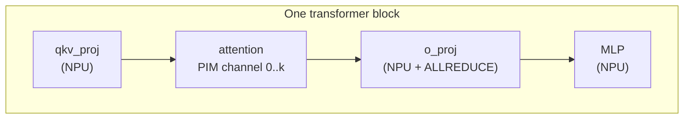

# PIM offload

Processing-in-memory (PIM) puts compute units physically inside DRAM,
turning a traditionally memory-bandwidth-bound kernel into a
compute-on-data-path operation. LLMServingSim models PIM as a
separate device that can take over **attention** specifically, the
rest of the layer still runs on the GPU.

This page describes how the PIM path lives inside the simulator. The
*configuration* angle (what flag to pass, how to wire up a PIM
device in the cluster config) is on
**[Examples → PIM attention offload](/docs/examples/disaggregated/pim-attention-offload)**.

## What gets offloaded, and what doesn't

When `--enable-attn-offloading` is on:

| Layer | Where it runs |
| --- | --- |
| `embedding`, `layernorm`, `qkv_proj`, `qk_norm`, `rotary_emb` | NPU |
| `attention` | **PIM** |
| `o_proj`, `gate_up_proj`, `act_fn`, `down_proj` | NPU |
| `final_layernorm`, `lm_head`, `sampler` | NPU |
| MoE block (if applicable) | NPU |

So only attention itself moves to PIM. The KV cache for attention
moves with it, KV blocks live in PIM memory rather than NPU memory,
which frees up NPU memory for weights or larger batches.

Token streams cross from NPU to PIM via memory writes (input
activation), then from PIM back to NPU via memory reads (attention
output). These crossings are modeled as memory transfers in the
trace.

## How it shows up in the trace



`trace_generator._emit_sequence` walks the architecture YAML's layer
list. When it sees an `attention` layer **and**
`enable_attn_offloading=True`, it swaps in a PIM block before the
NPU attention kernel:

```
... qkv_proj_3 ... (NPU)
PIM 0
pim_attention_3   (PIM device, modeled latency)
PIM END
... o_proj_3 ... (NPU, ALLREDUCE if TP > 1)
```

The `PIM 0` / `PIM END` markers tell the Chakra converter that the
contained operation runs on the PIM device with channel 0. The
converter emits a `COMP_NODE` for the PIM compute with memory access
patterns reflecting the PIM substrate.

The `pim_attention_<i>` entry's latency comes from the PIM model
(see below), not from the NPU attention CSV.

## The PIM model

`serving/core/pim_model.py` defines `PIMModel`. It's instantiated per
node when the cluster config has a
`cpu_mem.pim_config: "<config_name>"` field. The constructor reads
DRAMSim3 INI files at `configs/pim/<config_name>/`:

```
configs/pim/DDR4_8GB_3200_pim/
├── DDR4_8Gb_x16.ini    # DRAM device parameters
├── system.ini          # bus / channel layout
└── pim.ini             # PIM compute parameters
```

The INI files specify:

- **DRAM timing**: `tCAS`, `tRCD`, `tRP`, refresh interval, etc.
- **Layout**: banks per chip, channel count, row size, column size.
- **PIM compute**: operations per cycle per bank, instruction set
  caps.

`PIMModel` exposes the timing parameters to the trace generator,
which uses them to compute per-attention latency on PIM. The model
is intentionally simple, it's not a cycle-accurate DRAM model, but
captures bandwidth, parallelism (banks × channels), and operation
throughput well enough to compare PIM-vs-NPU attention paths.

## Multiple PIM channels

A node's PIM device can have multiple channels. Each channel has its
own bank-level parallelism, so different attention heads can run on
different channels in parallel. The trace generator distributes
attention work across channels by:

```
channel_for_head(h) = h * num_channels // num_attention_heads
```

This becomes the `PIM <channel>` marker in the trace. ASTRA-Sim sees
multiple `PIM 0`, `PIM 1`, ... blocks and runs them in parallel.

## KV cache in PIM memory

When PIM offload is on, KV blocks live in PIM memory (per-channel)
rather than NPU memory. The memory model accounts for this:

- `npu_used` drops by the KV-cache footprint.
- `pim_used` rises by the same amount.
- KV evictions go from PIM → CPU (or wherever `kv_evict_loc` is
  pointing) instead of NPU → CPU.

This is what makes PIM offload memory-attractive for long-context
workloads: the GPU's HBM is freed up to hold larger weights or more
in-flight requests.

## Why TPOT often improves but TTFT regresses

- **Decode** is memory-bandwidth-bound. PIM has high *aggregate*
  bandwidth (compute is co-located with the bytes), even if its raw
  GB/s per channel is lower than HBM. On long-context decode, PIM
  attention often beats GPU attention.
- **Prefill** is compute-bound on attention (long sequences scaled
  quadratically). PIM's narrower compute per channel doesn't help -
  in fact, it hurts. Workloads with mostly-prefill traffic regress
  on PIM offload.

The standard fix is **sub-batch interleaving**: overlap GPU compute
on one half of the batch with PIM attention on the other half. See
[Examples → Sub-batch interleaving](/docs/examples/advanced/sub-batch-interleaving).

## Throughput log additions

When PIM is active, the throughput log gains a `pim_busy=` field per
node:

```
[INFO] step=10 batch=8 prompt_t=1.1k tok/s decode_t=520 tok/s
       npu_mem=63.4 GB pim_busy=72%
```

`pim_busy` is the fraction of simulated time the PIM device was
running attention work in the last log interval. When this saturates
near 100%, PIM is your bottleneck, try multi-channel PIM, or revert
to NPU attention for prefill-heavy phases.

## Gotchas

1. **PIM offload is per-node.** `cpu_mem.pim_config` lives on the
   node, not the instance. Multiple instances on the same node share
   the same PIM device.
2. **`--enable-attn-offloading` is the CLI default.** Individual
   instances can override it with `enable_attn_offloading` in the
   cluster config, but any node that uses PIM offload still needs a
   `cpu_mem.pim_config`.
3. **The PIM CSV bundle isn't a thing.** Unlike NPU, PIM attention
   latency is computed analytically from the DRAMSim3 parameters
   plus `pim_model.py`'s arithmetic. Profiling a real PIM device is
   future work.
4. **Sub-batch interleaving requires PIM offload.** Without
   `--enable-attn-offloading`, `--enable-sub-batch-interleaving` is a
   no-op (everything's on NPU, there's nothing to overlap).
5. **DRAMSim3 INI tweaks land at next startup.** The simulator reads
   them once at boot. Changing parameters mid-run requires a
   restart.

## What's next

- **[Examples → PIM attention offload](/docs/examples/disaggregated/pim-attention-offload)** -
  the configuration walkthrough.
- **[Power model](./power-model)**: PIM has its own idle / active
  power parameters in the node `power` block.
